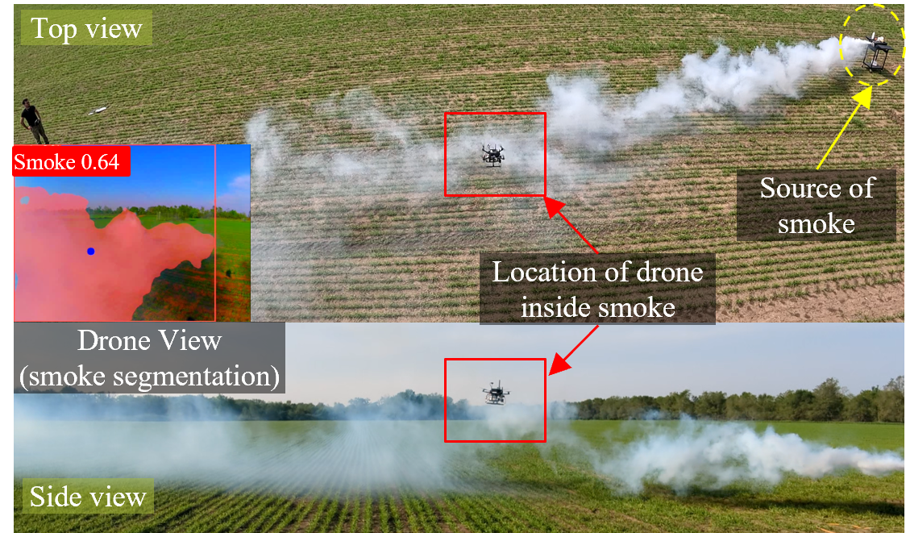

# Autonomous Drone for Dynamic Smoke Plume Tracking
This repository features the code base for the "Autonomous Drone for Dynamic Smoke Plume Tracking" project. Built on a quadrotor with Nvidia Jetson Orin Nano, it uses vision-based PID and PPO-based DRL controllers for real-time smoke tracking in unsteady wind conditions. The Unreal Engine simulation environment was used to develop and test the vision-based PID control algorithm for smoke plume tracking, as well as to train, test, and refine the deep reinforcement learning-based controller.

## Algorithm Overview

<div style="display: flex;">

  <!-- Left column with two stacked images -->
  <div style="flex: 1; display: flex; flex-direction: column; gap: 10px;">
    
    
  </div>

  <!-- Right column with a single, larger image -->
  <div style="flex: 1; margin-left: 10px;">
    
  </div>

</div>


<p align="center">
  
  
</p>


## Quick Start

The project setup utilizes an Nvidia Jetson Orin Nano, flashed with JetPack 5.1.3 (Ubuntu 20.04 LTS including TensorRT and ROS Noetic) and configured to boot from an NVMe SSD for optimal performance. The Jetson communicates with the Pixhawk via a USB connection.

### Clone Repository:
```bash
cd ~
mkdir gaia-autonomous-drone
cd gaia-autonomous-drone
mkdir src
cd src
git clone https://github.umn.edu/HongFlowFieldImagingLab/autonomous-drone-for-dynamic-smoke-plume-tracking.git
```

### Install Dependencies:

The install script is configured to install ROS Noetic and necessary dependencies for running YOLOv8 and Stable Baselines3 PPO. May need to run the installation script multiple times after the system automatically reboots until you see the message `Completing Installation of Dependencies ...` in the terminal. 

To execute the script, use the following commands:
```bash
cd ~/gaia-autonomous-drone/src/autonomous-drone-for-dynamic-smoke-plume-tracking/install_scripts
bash install_jetson_dependencies.sh
```

To further optimize RAM for running deep learning and deep reinforcement learning models on Jetson, refer to the additional steps outlined in this [link](https://www.jetson-ai-lab.com/tips_ram-optimization.html) .


### Building the ROS Package:
To finalize the installation, initialize and build the ROS package:
```bash
source ~/.bashrc
cd ~/gaia-autonomous-drone
catkin init
catkin build
echo "source ~/gaia-autonomous-drone/devel/setup.bash" >> ~/.bashrc
source ~/.bashrc
```

### Running Smoke Tracking Controller:
The "Quick Start" setup automatically adds necessary lines to `~/.bashrc` to source the repository and grant write permissions to the required serial port for communicating with the Pixhawk through MAVROS. With this configuration, the code is ready to run as soon as a terminal opens. 

To initiate smoke tracking, use the following command:
```bash
roslaunch autonomous_drone_for_dynamic_smoke_plume_tracking smoke_track_jetson.launch execution:=DEPLOY
```

### Configurable Parameters:
Three parameters can be specified when launching the controller:

* **'drone'** : Specifies the MAVROS namespace of the drone (default: `drone1`). Specify with `drone:=<namespace>` if different.

* **'execution'** : Specifies the execution environment, either `SIM` (Simulation; default) or `DEPLOY` (Jetson Deployment). Set `execution:=DEPLOY` for real-world deployment on Jetson.

* **'controller'** : Selects the controller type, `PID` (Proportional–Integral–Derivative Controller; default) or `DRL` (Deep Reinforcement Learning Controller). Set `controller:=DRL` to use the DRL-based controller.

Example command - 

For **executing in Jetson** on `drone2` with `DRL` controller:
```bash
roslaunch autonomous_drone_for_dynamic_smoke_plume_tracking smoke_track_jetson.launch drone:=drone2 execution:=DEPLOY controller:=DRL
```

### Troubleshooting:
Running this bash script (`./smoke_track_jetson.sh`) will start all the nodes in separate terminal (Terminator) windows:
```bash
cd ~/gaia-autonomous-drone/src/autonomous-drone-for-dynamic-smoke-plume-tracking/launch
chmod +x smoke_track_jetson.sh
./smoke_track_jetson.sh
```

To safely stop execution:
1. Press Ctrl-C in each terminal window individually, or 
2. Terminate all nodes simultaneoulsy with (recommended if any node has been sent to the background):
```bash
rosnode kill --all
```

## Drone Hardware Configuartions

The drone configuration follows the [GAIA drone setup](https://github.umn.edu/HongFlowFieldImagingLab/GAIA-drone-control/tree/peter-server), which is based on the [Holybro S500 v2 development kit](https://holybro.com/collections/s500/products/s500-v2-development-kit) with some upgrades to enhance performance for dynamic smoke tracking.

<p align="center">
  
</p>

### Hardware Upgrades:

1. **Jetson Orin Nano (Primary Edge Computing Board)**
	* **Upgrade:** The Jetson Orin Nano flashed with Jetpack 5.1.3 replaces the Jetson Xavier as the primary onboard computer.
	* **Recommendation:** Booting from an NVMe SSD is highly recommended to improve inference speeds for deep learning and deep reinforcement learning models in real-time. Details on setting up NVMe SSD boot can be found [here](https://forums.developer.nvidia.com/t/jetson-orin-nano-boot-from-nvme-ssd/252492).

2. **12 MP USB ArduCam (Primary Camera)**
	* **Upgrade:** The ArduCam has replaced the GoPro, providing higher resolution images faster in real-time.

3. **Updated Pixhawk Parameters**
	* **Upgrade:** Configured Pixhwak parameters for optimized drone performance - [link-to-parameter-list]().

4. **Custom 3D-Printed Enclosure and Battery Holder**
	* **Upgrade:** Custom-designed enclosure and battery holder for compactness and safety during operation.


## Unreal Engine 5 Simulation

Detailed instructions on how to setup the Unreal Engine 5.1.1 simulation environment from scratch for realistic smoke tracking is provided [here](). 

<p align="center">
  
</p>

### Running the Smoke Tracking Controller:
Given that the setup is done properly and `autonomous_drone_for_dynamic_smoke_tracking` package is built in WSL2, to start smoke trakcking simulation - play the simulation in UE, open a WSL2 terminal and run this command:
```bash
roslaunch autonomous_drone_for_dynamic_smoke_plume_tracking smoke_track_sim.launch execution:=SIM
```

### Configurable Parameters:
Three parameters ('drone', 'execution', and 'controller'), same as mentioned before in the Quick Start section (in 'Configurable parameters'), can be specified as arguments when launching the controller.

### Troubleshooting:
Run this bash script (`./smoke_track_sim.sh`) to start all the nodes in seprate terminals of WSL2:
```bash
cd ~/gaia-autonomous-drone/src/autonomous-drone-for-dynamic-smoke-plume-tracking/launch
chmod +x smoke_track_sim.sh
./smoke_track_sim.sh
```

To stop execution, press Ctrl-C in each terminal or to terminate all nodes at once using:
```bash
rosnode kill --all
```


